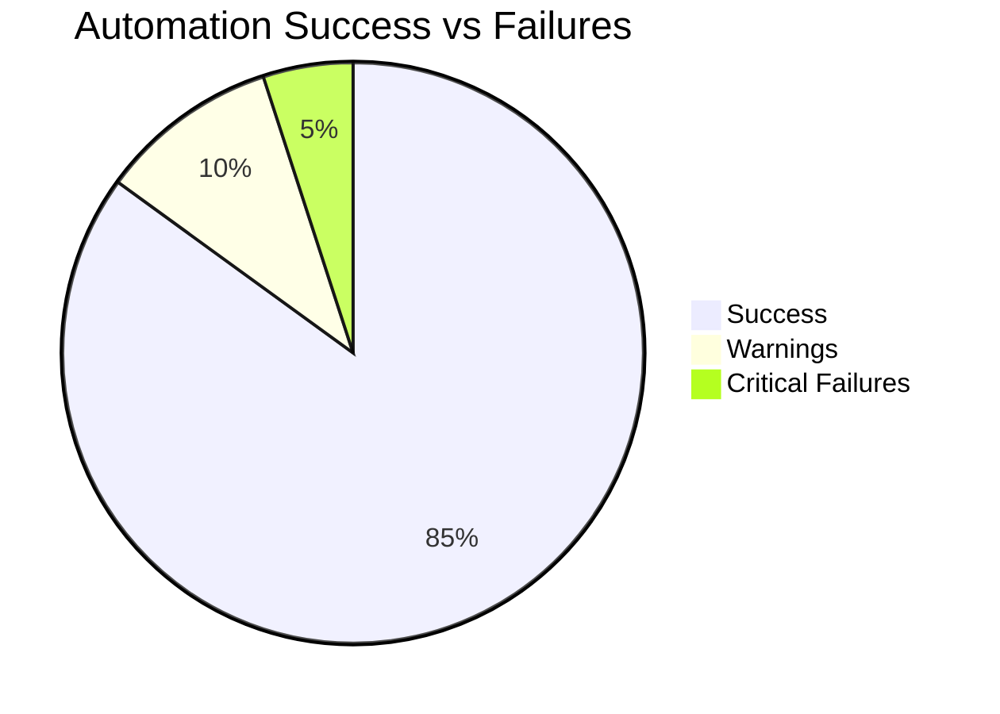
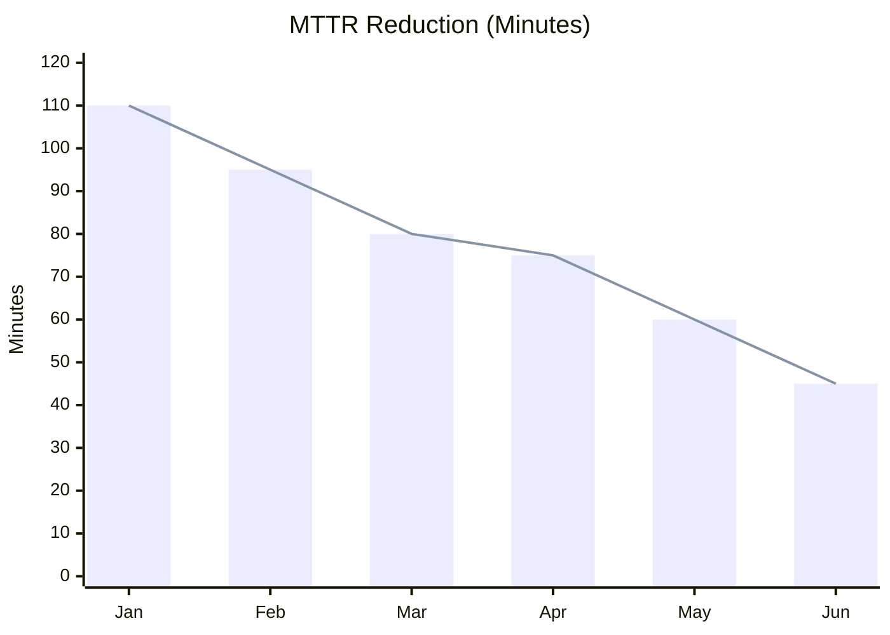
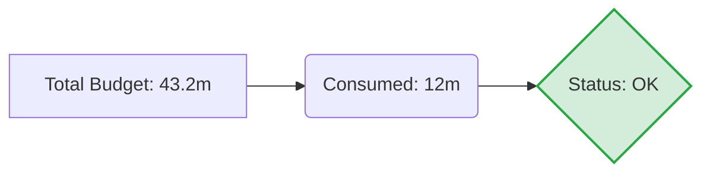

# Automation & Reliability Dashboard (Live Template)

**Toolkit Category:** Automation Trackers  
**When to Use:** Use this as a semi-automated visual dashboard to monitor the health of your IT operations and the success of automation initiatives.

---

## 1. Automation Success Rates
Track the reliability of automated scripts vs. manual execution.

## 2. MTTR Improvements (Monthly Trending)
Monitor the reduction in Mean Time To Repair (MTTR) as automation is implemented.

## 3. Error Budget Burn (Rolling 30 Days)
Visual representation of error budget consumption.

## 4. Automation ROI Tracker
| Initiative | Hours Saved / Month | MTTR Impact | Risk Reduction |
| :--- | :--- | :--- | :--- |
| **Log Rotation Script** | 10h | Low | High |
| **Auto-Scaling Policy** | 40h | High | Medium |
| **Self-Healing Bot** | 25h | Critical | Very High |

---
*Created by [Rahul Nethikar](https://rahulnethikar.github.io)*
