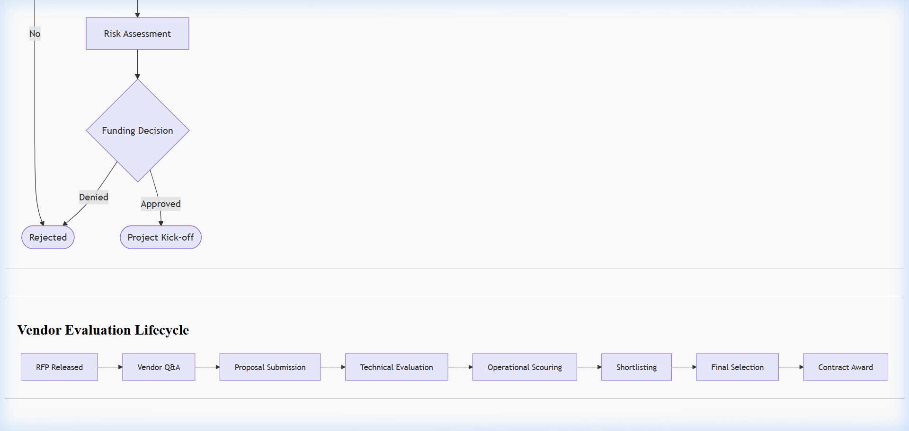

# Agile-SCRUM Management Template

## Document Control & Governance

| Field | Details |
| :--- | :--- |
| **Template ID** | ITSM-SCRUM-001 |
| **Version** | 2.0 |
| **Status** | Approved |
| **Owner** | Product Owner / Scrum Master |
| **Reviewed By** | Engineering Lead |
| **Approved By** | Head of Product |
| **Last Updated** | 2026-04-23 |
| **Next Review Date** | 2027-04-23 |

## 1. ITSM Control Fields (DevOps Alignment)

| Field | Value |
| :--- | :--- |
| **Priority** | [ ] P1 [ ] P2 [ ] P3 [ ] P4 |
| **Severity** | [ ] Critical [ ] Major [ ] Minor |
| **SLA (Response)** | |
| **SLA (Resolution)** | |
| **Environment** | [ ] Prod [ ] UAT [ ] Dev |
| **Service Name** | |

## 2. Traceability & Lifecycle

| Field | Value |
| :--- | :--- |
| **Linked Incident ID(s)** | |
| **Linked Problem ID** | |
| **Linked Change ID** | |
| **Linked RCA ID** | |
| **Linked CAPA ID** | |
| **Status** | [ ] Backlog [ ] In Sprint [ ] QA [ ] Done |
| **Closure Criteria** | |
| **Closure Date** | |

## 3. Ownership & Accountability (RACI)

| Role | Assigned Team / Individual |
| :--- | :--- |
| **Responsible** | |
| **Accountable** | |
| **Consulted** | |
| **Informed** | |

---

## 4. Sprint Identity & Goals
- **Sprint Name:**  
- **Sprint Goal:**  
- **Start/End Date:**  
- **Sprint Velocity (Target):**  

## 5. Sprint Backlog (SLA-Driven Prioritization)
| Ticket ID | Description | Linked INC/PRB | Prod Impact | Owner | Points | Status |
| :--- | :--- | :--- | :--- | :--- | :--- | :--- |
| SRE-101 | Automate backup validation | INC-502 | [ ] Yes | Rahul | 5 | In Progress |
| OPS-204 | Update SOP | PRB-101 | [ ] No | Team | 3 | Done |

## 6. Ceremony Checklists

### 📅 Sprint Planning
- [ ] Review Backlog & SLA-driven Prioritization
- [ ] Define Sprint Goal
- [ ] Confirm Team Capacity
- [ ] Task Breakdown & Point Allocation

### ☕ Daily Stand-up
- [ ] What did we do yesterday?
- [ ] What will we do today?
- [ ] Any blockers/impediments?

### 🔍 Sprint Review & Retrospective
- [ ] Demo completed features to stakeholders
- [ ] **What went well?**
- [ ] **What could be improved?**
- [ ] **Action items for next sprint:**

## 7. Impediment Tracker
| Blocker Description | Owner | Impact | Resolution Status |
| :--- | :--- | :--- | :--- |
| Delay in IAM approval | SecOps | High | Escalated |

## Visual Workflow

## Evidence & References

* **Logs:**
* **Monitoring Alerts:**
* **Screenshots:**
* **Ticket Links:**

---
*Created by [Rahul Nethikar](https://rahulnethikar.github.io)*
*Upgraded to ITIL 4 & ISO 20000 Standards*
