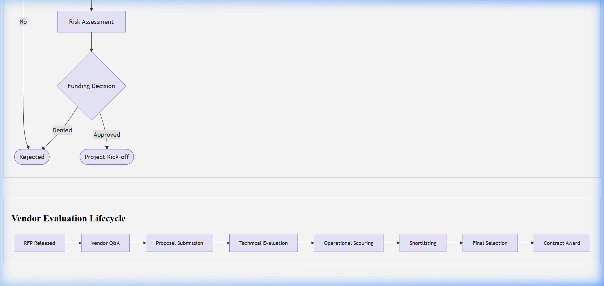

# IT Strategic Business Case Template

## Document Control & Governance

| Field | Details |
| :--- | :--- |
| **Template ID** | ITSM-BC-001 |
| **Version** | 2.0 |
| **Status** | Approved |
| **Owner** | Project Management Office (PMO) |
| **Reviewed By** | Financial Director |
| **Approved By** | CIO |
| **Last Updated** | 2026-04-23 |
| **Next Review Date** | 2027-04-23 |

## 1. ITSM Control Fields

| Field | Value |
| :--- | :--- |
| **Priority** | [ ] P1 [ ] P2 [ ] P3 [ ] P4 |
| **Impact** | [ ] Users [ ] Systems [ ] Revenue |
| **SLA (Response)** | |
| **SLA (Resolution)** | |
| **Environment** | [ ] Prod [ ] UAT [ ] Dev |
| **Service Name** | |

## 2. Traceability & Lifecycle

| Field | Value |
| :--- | :--- |
| **Linked Incident ID(s)** | |
| **Linked Problem ID** | |
| **Linked Change ID** | |
| **Linked RCA ID** | |
| **Linked CAPA ID** | |
| **Status** | [ ] New [ ] In Progress [ ] Under Review [ ] Approved |
| **Closure Criteria** | |
| **Closure Date** | |

## 3. Ownership & Accountability (RACI)

| Role | Assigned Team / Individual |
| :--- | :--- |
| **Responsible** | |
| **Accountable** | |
| **Consulted** | |
| **Informed** | |

---

## 4. Executive Summary & ITSM Alignment
- **Project Name:**  
- **Sponsor:**  
- **Objective:** (High-level goal in 1-2 sentences)  
- **ITSM Alignment:**
  - **Incident Impact:** (How will this reduce incident volume/MTTR?)
  - **Change Impact:** (How does this improve change success rate?)
  - **Problem Impact:** (How does this address known errors/PRBs?)

## 5. Problem Statement & Opportunity
Describe the current state, pain points, and why action is required now.
- [ ] Gap in current service delivery
- [ ] Technical debt / Legacy system risk
- [ ] **Compliance Requirements:** [ ] ISO 20000 [ ] ISO 27001 [ ] SOC2 [ ] HIPAA

## 6. Proposed Solution
Detail the technical and operational approach.
- **Approach:**  
- **Key Features:**  
- **Alternative Options Considered:** 

## 7. Strategic Alignment
| Goal | Alignment Level | Impact |
| :--- | :--- | :--- |
| Cost Optimization | High/Med/Low | Description |
| Operational Excellence | High/Med/Low | Description |
| Risk Mitigation | High/Med/Low | Description |

## 8. Cost-Benefit Analysis (CBA)
| Category | Year 1 | Year 2 | Year 3 |
| :--- | :--- | :--- | :--- |
| **CapEx** | $0.00 | $0.00 | $0.00 |
| **OpEx** | $0.00 | $0.00 | $0.00 |
| **Tangible Benefits** | $0.00 | $0.00 | $0.00 |
| **ROI / Payback** | | | |

## 9. Risk Assessment & Operational Scoring
| Risk Factor | Probability | Impact | **Operational Risk Score** | Mitigation Strategy |
| :--- | :--- | :--- | :--- | :--- |
| Resource Availability | | | | |
| Technical Integration | | | | |
| Security/Compliance | | | | |

## 10. Recommendation & Next Steps
- [ ] Approval of funding
- [ ] Resources allocation
- [ ] Timeline kick-off: YYYY-MM-DD

## Visual Workflow

## Evidence & References

* **Logs:**
* **Monitoring Alerts:**
* **Screenshots:**
* **Ticket Links:**

---
*Created by [Rahul Nethikar](https://rahulnethikar.github.io)*
*Upgraded to ITIL 4 & ISO 20000 Standards*
