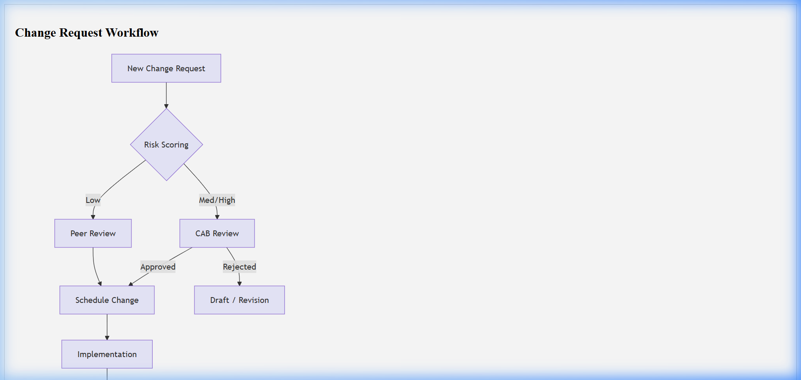

# ITIL Change Request (CR) Template

## Document Control & Governance

| Field | Details |
| :--- | :--- |
| **Template ID** | ITSM-CR-001 |
| **Version** | 2.0 |
| **Status** | Approved |
| **Owner** | Change Advisory Board (CAB) |
| **Reviewed By** | IT Operations Lead |
| **Approved By** | Head of Infrastructure |
| **Last Updated** | 2026-04-23 |
| **Next Review Date** | 2027-04-23 |

## 1. ITSM Control Fields

| Field | Value |
| :--- | :--- |
| **Priority** | [ ] P1 [ ] P2 [ ] P3 [ ] P4 |
| **Severity** | [ ] Critical [ ] Major [ ] Minor |
| **Impact** | [ ] Users [ ] Systems [ ] Revenue |
| **Urgency** | [ ] Emergency [ ] High [ ] Medium [ ] Low |
| **SLA (Response)** | |
| **SLA (Resolution)** | |
| **Environment** | [ ] Prod [ ] UAT [ ] Dev |
| **Service Name** | |

## 2. Traceability & Lifecycle

| Field | Value |
| :--- | :--- |
| **Linked Incident ID(s)** | |
| **Linked Problem ID** | |
| **Linked Change ID** | |
| **Linked RCA ID** | |
| **Linked CAPA ID** | |
| **Status** | [ ] New [ ] In Progress [ ] Under Review [ ] Closed |
| **Closure Criteria** | |
| **Closure Date** | |

## 3. Ownership & Accountability (RACI)

| Role | Assigned Team / Individual |
| :--- | :--- |
| **Responsible** | |
| **Accountable** | |
| **Consulted** | |
| **Informed** | |

---

## 4. Change Classification & Risk

| Field | Details |
| :--- | :--- |
| **Change ID** | |
| **Change Type** | [ ] Standard [ ] Normal [ ] Emergency |
| **Risk Score** | [ ] Low [ ] Medium [ ] High |
| **Risk Justification** | |
| **Change Window** | Start: YYYY-MM-DD HH:MM / End: YYYY-MM-DD HH:MM |

## 5. Basic Information
- **Change Title:**  
- **Requestor:**  
- **Owner/Assignee:**  
- **CAB Review Required?** [ ] Yes / [ ] No  

## 6. Detailed Change Description
Describe the "Before" and "After" states.
- **Current State:**  
- **Proposed State:**  
- **Components Affected:**  

## 7. Implementation & Validation Plan

### Pre-Implementation Validation
- [ ] List checks to perform before starting...

### Implementation Steps
| Step | Action | Time Estimate |
| :--- | :--- | :--- |
| **Backup** | Run snapshot script | 10m |
| **Execution** | Deploy package | 30m |
| **Verification** | Run regression suite | 15m |

### Post-Implementation Validation
- [ ] List checks to perform after completion...

## 8. Rollback & Backout Plan
- **Rollback Criteria:** (e.g. Failure of API test 05)  
- **Rollback Steps:**  
- **Backout Success Criteria:**  

## 9. CAB Approval Section (Mandatory)
| CAB Member | Approval Status | Date | Comments |
| :--- | :--- | :--- | :--- |
| Change Manager | | | |
| Technical Lead | | | |
| Security Officer | | | |

## Visual Workflow

## Evidence & References

* **Logs:**
* **Monitoring Alerts:**
* **Screenshots:**
* **Ticket Links:**

---
*Created by [Rahul Nethikar](https://rahulnethikar.github.io)*
*Upgraded to ITIL 4 & ISO 20000 Standards*
