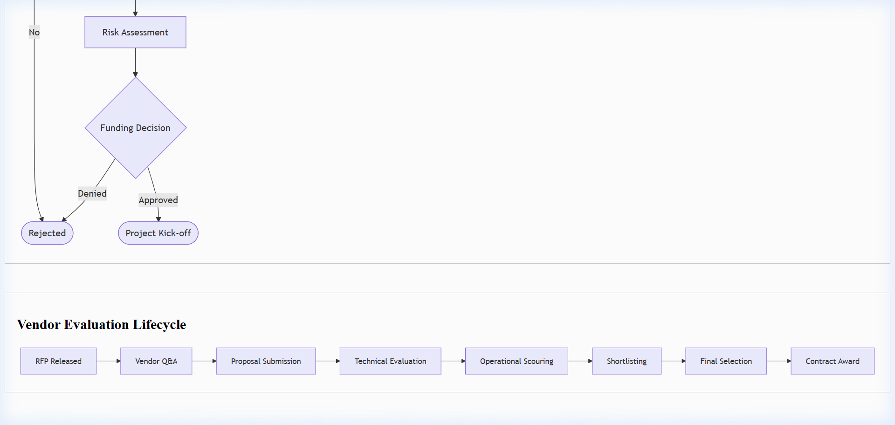

# IAM Production Access Request Template

## Document Control & Governance

| Field | Details |
| :--- | :--- |
| **Template ID** | ITSM-IAM-001 |
| **Version** | 2.0 |
| **Status** | Approved |
| **Owner** | Security & Compliance |
| **Reviewed By** | CISO |
| **Approved By** | Head of DevOps |
| **Last Updated** | 2026-04-23 |
| **Next Review Date** | 2027-04-23 |

## 1. ITSM Control Fields

| Field | Value |
| :--- | :--- |
| **Priority** | [ ] P1 [ ] P2 [ ] P3 [ ] P4 |
| **Severity** | [ ] Critical [ ] Major [ ] Minor |
| **Impact** | [ ] Users [ ] Systems [ ] Revenue |
| **Urgency** | [ ] High [ ] Medium [ ] Low |
| **SLA (Response)** | |
| **SLA (Resolution)** | |
| **Environment** | [ ] Prod [ ] UAT [ ] Dev |
| **Service Name** | |

## 2. Traceability & Lifecycle

| Field | Value |
| :--- | :--- |
| **Linked Incident ID(s)** | |
| **Linked Problem ID** | |
| **Linked Change ID** | |
| **Linked RCA ID** | |
| **Linked CAPA ID** | |
| **Status** | [ ] New [ ] In Progress [ ] Under Review [ ] Closed |
| **Closure Criteria** | |
| **Closure Date** | |

## 3. Ownership & Accountability (RACI)

| Role | Assigned Team / Individual |
| :--- | :--- |
| **Responsible** | |
| **Accountable** | |
| **Consulted** | |
| **Informed** | |

---

## 4. Risk & Compliance Classification

| Field | Details |
| :--- | :--- |
| **Risk Classification** | [ ] Low [ ] Moderate [ ] High [ ] Critical |
| **Data Sensitivity Level** | [ ] Public [ ] Internal [ ] Confidential [ ] Restricted (PII/PCI) |
| **Access Review Frequency** | [ ] Monthly [ ] Quarterly [ ] Bi-Annually |
| **Auto-expiry Enforcement** | [ ] Enabled [ ] Disabled |
| **Expiry Date** | YYYY-MM-DD |

## 5. Requestor & Access Details
- **Full Name:**  
- **Employee ID:**  
- **Department:**  
- **Manager:**  

| System / Tool | Access Level | Duration |
| :--- | :--- | :--- |
| AWS Production | Read-Only / Admin | Temporary / Permanent |
| GitHub Org | Admin / Member | Permanent |
| Jira Project | Lead / User | Permanent |

## 6. Business Justification
Why is this access required?
- **Project/Ticket Ref:** (e.g. JIRA-405)  
- **Justification:**  

## 7. Security & Compliance Checklist
- [ ] Multi-Factor Authentication (MFA) enabled?
- [ ] User has completed Security Awareness Training?
- [ ] Principle of Least Privilege (PoLP) followed?
- [ ] Temporary access only? (If yes, specify expiry)

## 8. Approval Workflow
- [ ] **Manager Approval:** (Signed/Date)
- [ ] **Data Owner Approval:** (Signed/Date)
- [ ] **Security Team Review:** (Signed/Date)

## Visual Workflow

## Evidence & References

* **Logs:**
* **Monitoring Alerts:**
* **Screenshots:**
* **Ticket Links:**

---
*Created by [Rahul Nethikar](https://rahulnethikar.github.io)*
*Upgraded to ITIL 4 & ISO 20000 Standards*
