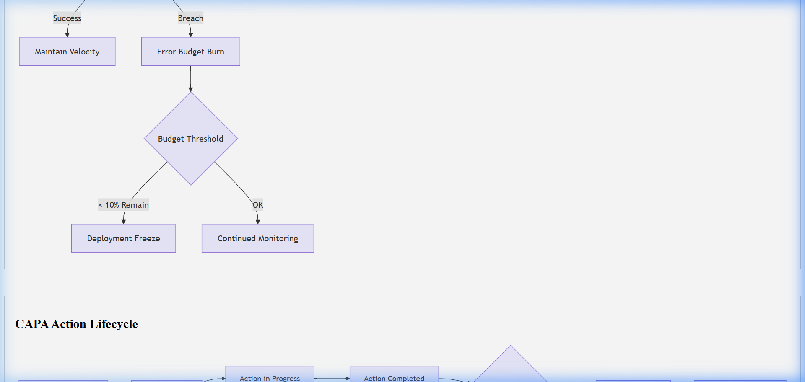

# Operational Runbook / SOP Template

## Document Control & Governance

| Field | Details |
| :--- | :--- |
| **Template ID** | ITSM-SOP-001 |
| **Version** | 2.0 |
| **Status** | Approved |
| **Owner** | Operations Team |
| **Reviewed By** | Platform Engineer |
| **Approved By** | Operations Manager |
| **Last Updated** | 2026-04-23 |
| **Next Review Date** | 2027-04-23 |

## 1. ITSM Control Fields

| Field | Value |
| :--- | :--- |
| **Priority** | [ ] P1 [ ] P2 [ ] P3 [ ] P4 |
| **Severity** | [ ] Critical [ ] Major [ ] Minor |
| **Impact** | [ ] Users [ ] Systems [ ] Revenue |
| **Urgency** | [ ] High [ ] Medium [ ] Low |
| **SLA (Response)** | |
| **SLA (Resolution)** | |
| **Environment** | [ ] Prod [ ] UAT [ ] Dev |
| **Service Name** | |

## 2. Traceability & Lifecycle

| Field | Value |
| :--- | :--- |
| **Linked Incident ID(s)** | |
| **Linked Problem ID** | |
| **Linked Change ID** | |
| **Linked RCA ID** | |
| **Linked CAPA ID** | |
| **Status** | [ ] Draft [ ] Under Review [ ] Approved [ ] Deprecated |
| **Closure Criteria** | |
| **Closure Date** | |

## 3. Ownership & Accountability (RACI)

| Role | Assigned Team / Individual |
| :--- | :--- |
| **Responsible** | |
| **Accountable** | |
| **Consulted** | |
| **Informed** | |

---

## 4. Runbook Metadata & Governance

| Field | Details |
| :--- | :--- |
| **Execution Frequency** | [ ] Daily [ ] Weekly [ ] Monthly [ ] On-Demand |
| **Automation Feasibility**| [ ] Low [ ] Medium [ ] High [ ] Already Automated |
| **Pre-Check Validation** | Mandatory steps to confirm system health before execution |
| **Post-Check Validation**| Mandatory steps to confirm success after execution |

## 5. Objective & Scope
What problem does this SOP solve? Who should execute it?
- **Objective:**  
- **Prerequisites:** (e.g. Admin access, VPN connected)  

## 6. Step-by-Step Instructions

### Pre-Check Validation
- [ ] Confirm disk space > 20%
- [ ] Verify primary service is active...

### Execution Steps
| Step | Action | Expected Result | Screenshot/Ref |
| :--- | :--- | :--- | :--- |
| 1 | Navigate to Portal | Login screen displayed | Admin_UI_01 |
| 2 | Select "Backup" | Backup options visible | Admin_UI_02 |
| 3 | Run Script `bk_v1.sh` | Status: Complete | Terminal_Log |

### Post-Check Validation
- [ ] Verify logs at `/var/log/app.log`
- [ ] Final service status: `systemctl status app`

## 7. Failure Scenarios & Recovery
| Scenario | Detection | Recovery Action |
| :--- | :--- | :--- |
| Permission Denied | Log Error 403 | Contact IAM Team |
| Script Timeout | No output for 5m | Restart service and retry once |
| Data Corruption | Checksum mismatch | Trigger Rollback immediately |

## 8. Rollback Plan
If something goes wrong, what are the steps to undo?
1. Step 1...
2. Step 2...

## 9. Escalation Matrix
| Issue Type | Level | Contact |
| :--- | :--- | :--- |
| Permission Denied | Level 1 | IAM Team |
| Script Failure | Level 2 | DevOps Lead |
| Service Outage | Level 3 | SRE Manager |

## Visual Workflow

## Evidence & References

* **Logs:**
* **Monitoring Alerts:**
* **Screenshots:**
* **Ticket Links:**

---
*Created by [Rahul Nethikar](https://rahulnethikar.github.io)*
*Upgraded to ITIL 4 & ISO 20000 Standards*
