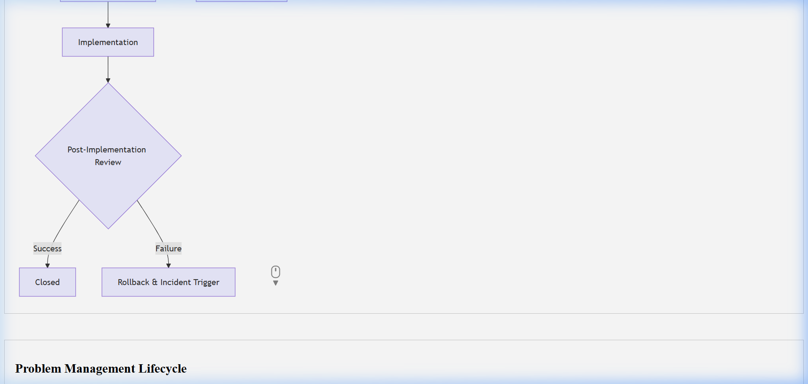

# Problem Management Record (PMR) Template

## Document Control & Governance

| Field | Details |
| :--- | :--- |
| **Template ID** | ITSM-PMR-001 |
| **Version** | 2.0 |
| **Status** | Approved |
| **Owner** | Problem Management Team |
| **Reviewed By** | SRE Lead |
| **Approved By** | Head of Reliability |
| **Last Updated** | 2026-04-23 |
| **Next Review Date** | 2027-04-23 |

## 1. ITSM Control Fields

| Field | Value |
| :--- | :--- |
| **Priority** | [ ] P1 [ ] P2 [ ] P3 [ ] P4 |
| **Severity** | [ ] Critical [ ] Major [ ] Minor |
| **Impact** | [ ] Users [ ] Systems [ ] Revenue |
| **Urgency** | [ ] High [ ] Medium [ ] Low |
| **SLA (Response)** | |
| **SLA (Resolution)** | |
| **Environment** | [ ] Prod [ ] UAT [ ] Dev |
| **Service Name** | |

## 2. Traceability & Lifecycle

| Field | Value |
| :--- | :--- |
| **Linked Incident ID(s)** | |
| **Linked Problem ID** | |
| **Linked Change ID** | |
| **RCA Link (Mandatory)** | |
| **Linked CAPA ID** | |
| **Status** | [ ] New [ ] In Progress [ ] Under Review [ ] Closed |
| **Closure Criteria** | |
| **Closure Date** | |

## 3. Ownership & Accountability (RACI)

| Role | Assigned Team / Individual |
| :--- | :--- |
| **Responsible** | |
| **Accountable** | |
| **Consulted** | |
| **Informed** | |

---

## 4. Problem Identification & Scope
- **Problem ID:**  
- **Business Impact Quantification:** (e.g., Financial loss, downtime hours, user volume)
- **Assigned Team:**  

## 5. Symptom Analysis
Describe what is happening from the user's perspective.
- **Symptom:**  
- **Scope of Impact:** (e.g. All EMEA users)  
- **Current Workaround:** (If any)  
- **Workaround Validation Status:** [ ] Validated [ ] Pending Review [ ] Failed

## 6. Known Error Record (KER)
| Field | Details |
| :--- | :--- |
| **KER ID** | |
| **Error Description** | |
| **Permanent Fix Status** | [ ] Identified [ ] Planned [ ] Implemented |
| **Known Limitations** | |

## 7. Investigation Log
| Date | Action Taken | Result / Finding | Investigator |
| :--- | :--- | :--- | :--- |
| YYYY-MM-DD | Log Review | Found memory leak in v1.2 | Rahul |
| YYYY-MM-DD | Code Audit | Identified improper socket closing | Team |

## 8. Root Cause Analysis
The ultimate underlying cause identified after investigation.
- **Root Cause:**  
- **Primary Category:** [ ] Software Bug [ ] Configuration Error [ ] Human Error [ ] Capacity Issue  

## 9. Permanent Corrective Action (PCA)
What will be done to ensure this never happens again?
| Action Item | Owner | Target Date | Status |
| :--- | :--- | :--- | :--- |
| Refactor socket handler | Dev Team | YYYY-MM-DD | Planned |
| Implement monitoring for leak | SRE | YYYY-MM-DD | In Progress |

## Visual Workflow

## Evidence & References

* **Logs:**
* **Monitoring Alerts:**
* **Screenshots:**
* **Ticket Links:**

---
*Created by [Rahul Nethikar](https://rahulnethikar.github.io)*
*Upgraded to ITIL 4 & ISO 20000 Standards*
