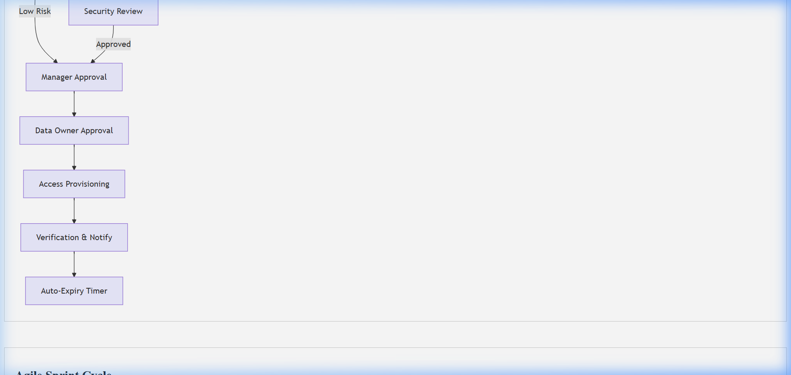

# Process Improvement (DMAIC) Template

## Document Control & Governance

| Field | Details |
| :--- | :--- |
| **Template ID** | ITSM-DMAIC-001 |
| **Version** | 2.0 |
| **Status** | Approved |
| **Owner** | Continuous Improvement Lead |
| **Reviewed By** | Quality Manager |
| **Approved By** | Head of Process Excellence |
| **Last Updated** | 2026-04-23 |
| **Next Review Date** | 2027-04-23 |

## 1. ITSM Control Fields

| Field | Value |
| :--- | :--- |
| **Priority** | [ ] P1 [ ] P2 [ ] P3 [ ] P4 |
| **Impact** | [ ] Users [ ] Systems [ ] Revenue |
| **SLA (Response)** | |
| **SLA (Resolution)** | |
| **Environment** | [ ] Prod [ ] UAT [ ] Dev |
| **Service Name** | |

## 2. Traceability & Lifecycle

| Field | Value |
| :--- | :--- |
| **Linked Incident ID(s)** | |
| **Linked Problem ID** | |
| **Linked Change ID** | |
| **Linked RCA ID** | |
| **Linked CAPA ID** | |
| **Status** | [ ] Define [ ] Measure [ ] Analyze [ ] Improve [ ] Control [ ] Closed |
| **Closure Criteria** | |
| **Closure Date** | |

## 3. Ownership & Accountability (RACI)

| Role | Assigned Team / Individual |
| :--- | :--- |
| **Responsible** | |
| **Accountable** | |
| **Consulted** | |
| **Informed** | |

---

## 4. DEFINE: The Problem & Financial Impact
Define the project goals and customer (internal/external) requirements.
- **Problem Statement:**  
- **Goal Statement:** (e.g. Reduce MTTR by 20%)  
- **Financial Impact:** (Estimated savings, cost of poor quality)
- **Stakeholders:**  

## 5. MEASURE: Project Performance (SLA/KPI)
Collect data and validate the current process performance.
- **Control Metrics (SLA/KPI):**  
- **Baseline Performance:**  
- **Process Map (SIPOC):** (Suppliers, Inputs, Process, Outputs, Customers)

## 6. ANALYZE: The Root Cause
Analyze the process to identify root causes of variations or defects.
- [ ] **Fishbone Analysis** completed?
- [ ] **5-Whys** performed?
- **Identified Root Causes:**
| Root Cause | Impact | Evidence |
| :--- | :--- | :--- |
| Manual Data Entry | High | Data corruption logs |
| Lack of SOP | Med | Variance in execution |

## 7. IMPROVE: Implement Solutions
Pilot and implement solutions to address root causes.
- **Proposed Improvements:**  
- **Implementation Plan:**  
- **Risk Mitigation:**  

## 8. CONTROL: Sustain Improvements
Control the improved process to ensure the gains are sustained.
- **Monitoring Plan:**  
- **Response Plan:** (What if performance drops?)  
- **Sustainability Validation:** (How will this be maintained long-term?)
- **SOP Updated?** (Yes/No)

## Visual Workflow

## Evidence & References

* **Logs:**
* **Monitoring Alerts:**
* **Screenshots:**
* **Ticket Links:**

---
*Created by [Rahul Nethikar](https://rahulnethikar.github.io)*
*Upgraded to ITIL 4 & ISO 20000 Standards*
