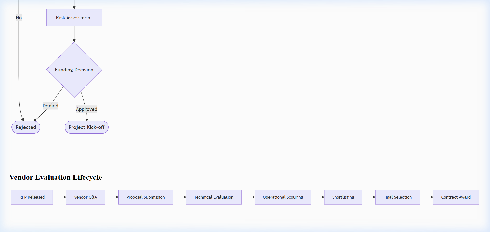

# Request for Proposal (RFP) Template

## Document Control & Governance

| Field | Details |
| :--- | :--- |
| **Template ID** | ITSM-RFP-001 |
| **Version** | 2.0 |
| **Status** | Approved |
| **Owner** | Procurement / IT Strategy |
| **Reviewed By** | Legal Counsel |
| **Approved By** | Head of Procurement |
| **Last Updated** | 2026-04-23 |
| **Next Review Date** | 2027-04-23 |

## 1. ITSM Control Fields

| Field | Value |
| :--- | :--- |
| **Priority** | [ ] P1 [ ] P2 [ ] P3 [ ] P4 |
| **Impact** | [ ] Users [ ] Systems [ ] Revenue |
| **Environment** | [ ] Prod [ ] UAT [ ] Dev |
| **Service Name** | |

## 2. Traceability & Lifecycle

| Field | Value |
| :--- | :--- |
| **Linked Incident ID(s)** | |
| **Linked Problem ID** | |
| **Linked Change ID** | |
| **Linked RCA ID** | |
| **Linked CAPA ID** | |
| **Status** | [ ] Draft [ ] Released [ ] Evaluation [ ] Awarded |
| **Closure Criteria** | |
| **Closure Date** | |

## 3. Ownership & Accountability (RACI)

| Role | Assigned Team / Individual |
| :--- | :--- |
| **Responsible** | |
| **Accountable** | |
| **Consulted** | |
| **Informed** | |

---

## 4. Project Background & ITSM Alignment
- **Project Name:**  
- **Issuing Entity:**  
- **Objective:**  
- **ITSM Alignment:**
  - **Incident/Problem Impact:** (How will this solution address current operational pain points?)
  - **Change Impact:** (Ease of integration into current Change Management processes)

## 5. Requirements Specification
List mandatory and desirable features.
- [ ] **Compliance Requirements:** [ ] ISO 20000 [ ] ISO 27001 [ ] SOC2 [ ] HIPAA [ ] GDPR
- [ ] **Technical:** (e.g. API access, 99.9% uptime, Multi-region)
- [ ] **Functional:** (e.g. Real-time reporting, SSO integration)
- [ ] **Operational:** (e.g. 24x7 support, Dedicated account manager)

## 6. Vendor Qualifications & Operational Risk
| Category | Requirement | Criticality | **Operational Risk Score** |
| :--- | :--- | :--- | :--- |
| Experience | Minimum 5 years in sector | High | |
| Certifications | SOC2 / ISO 27001 | High | |
| Client Base | 3+ Referenceable accounts | Medium | |

## 7. Evaluation Criteria
Proposals will be weighted based on:
1. **Technical Capability:** 40%
2. **Cost Effectiveness:** 30%
3. **Operational Experience:** 20%
4. **Compliance & Risk:** 10%

## 8. Submission Schedule
| Milestone | Date |
| :--- | :--- |
| **RFP Released** | YYYY-MM-DD |
| **Vendor Q&A Deadline** | YYYY-MM-DD |
| **Final Proposal Due** | YYYY-MM-DD |
| **Vendor Selection** | YYYY-MM-DD |

## 9. Pricing Model Checklist
- [ ] Subscription / License cost
- [ ] Implementation / Setup fee
- [ ] Support & Maintenance (Annual)
- [ ] Variable/Usage costs

## Visual Workflow

## Evidence & References

* **Logs:**
* **Monitoring Alerts:**
* **Screenshots:**
* **Ticket Links:**

---
*Created by [Rahul Nethikar](https://rahulnethikar.github.io)*
*Upgraded to ITIL 4 & ISO 20000 Standards*
