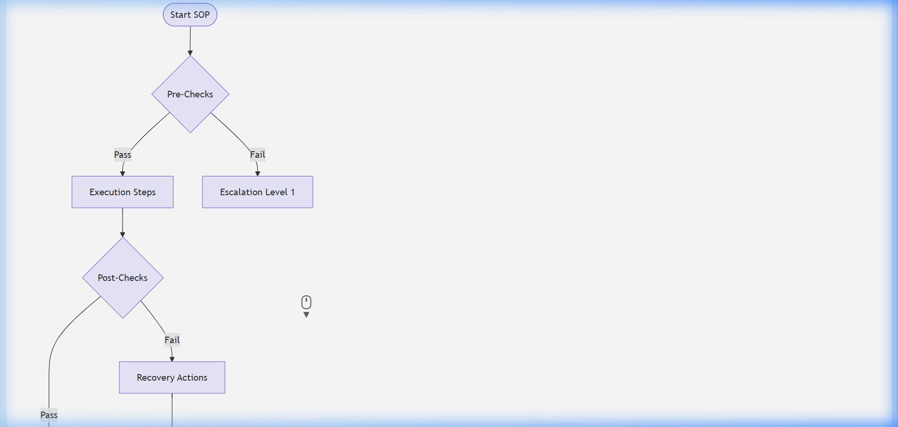

# Root Cause Analysis (RCA) Report

## Document Control & Governance

| Field | Details |
| :--- | :--- |
| **Template ID** | ITSM-RCA-001 |
| **Version** | 2.0 |
| **Status** | Approved |
| **Owner** | SRE / Incident Management |
| **Reviewed By** | Engineering Manager |
| **Approved By** | VP of Operations |
| **Last Updated** | 2026-04-23 |
| **Next Review Date** | 2027-04-23 |

## 1. ITSM Control Fields

| Field | Value |
| :--- | :--- |
| **Priority** | [ ] P1 [ ] P2 [ ] P3 [ ] P4 |
| **Severity** | [ ] Critical [ ] Major [ ] Minor |
| **Impact** | [ ] Users [ ] Systems [ ] Revenue |
| **Urgency** | [ ] High [ ] Medium [ ] Low |
| **SLA (Response)** | |
| **SLA (Resolution)** | |
| **Environment** | [ ] Prod [ ] UAT [ ] Dev |
| **Service Name** | |

## 2. Traceability & Lifecycle

| Field | Value |
| :--- | :--- |
| **Linked Incident ID(s)** | |
| **Linked Problem ID** | |
| **Linked Change ID** | |
| **Linked RCA ID** | |
| **Linked CAPA ID** | |
| **Status** | [ ] New [ ] In Progress [ ] Under Review [ ] Closed |
| **Closure Criteria** | |
| **Closure Date** | |

## 3. Ownership & Accountability (RACI)

| Role | Assigned Team / Individual |
| :--- | :--- |
| **Responsible** | |
| **Accountable** | |
| **Consulted** | |
| **Informed** | |

---

## 4. Incident Overview & Impact
- **Incident ID:**  
- **Title:**  
- **Detection Method:** [ ] Monitoring Alert [ ] User Report [ ] Third-Party Discovery
- **Total Duration of Outage:**  
- **Business Impact:**
  - **Users Affected:**
  - **Downtime:**
  - **Financial Impact:**

## 5. Escalation Timeline
| Time (UTC) | Event / Action | Result | Escalation Level |
| :--- | :--- | :--- | :--- |
| 10:00 | Outage detected by monitoring | Alerts sent | L1 |
| 10:15 | On-call SRE investigated logs | High CPU found | L2 |
| 10:45 | Service restarted | Partial recovery | L2 |
| 11:30 | Fix deployed | Full recovery | L3 |

## 6. RCA Methodology
- **RCA Method Used:** [ ] 5 Whys [ ] Fishbone (Ishikawa) [ ] Fault Tree Analysis [ ] Other:

## 7. Investigation: The 5-Whys
1. **The problem:** Web server crashed.
   - **Why?** CPU usage hit 100%.
2. **Why?** A specific process was stuck in an infinite loop.
   - **Why?** It received an unexpected null value from the database.
3. **Why?** The database schema was updated without updating the application code.
   - **Why?** The deployment script missed the code update step.
4. **Why?** The script was modified manually and not tested in staging.
   - **Why?** (Root Cause found) **Lack of automated CI/CD pipeline and deployment peer review.**

## 8. Investigative Diagram (Fishbone/Ishikawa)
- **People:** Lack of training on script modification.
- **Process:** No peer review for deployment scripts.
- **Platform:** Staging environment did not mirror production.
- **Technology:** Deployment script had no error handling.

## 9. Corrective & Preventive Actions (CAPA)
| Action Item | Category | Due Date | Owner |
| :--- | :--- | :--- | :--- |
| Implement CI/CD pipeline | Technology | YYYY-MM-DD | SRE Team |
| Mandate Peer Review for all scripts | Process | Immediate | Manager |

## 10. Lessons Learned
- **What worked well during response?**
- **What were the major friction points?**
- **Policy/Process changes required:**

## Visual Workflow

### Forensic Investigation Flow

### RCA Logic (Fishbone Concept)
 

## Evidence & References

* **Logs:**
* **Monitoring Alerts:**
* **Screenshots:**
* **Ticket Links:**

---
*Created by [Rahul Nethikar](https://rahulnethikar.github.io)*
*Upgraded to ITIL 4 & ISO 20000 Standards*
