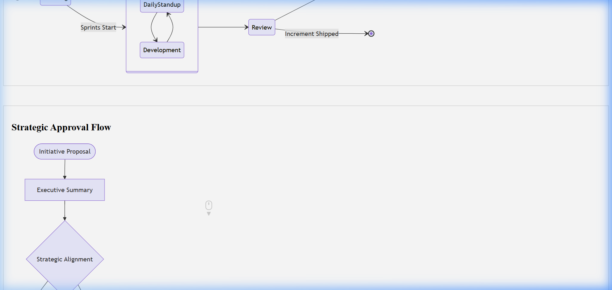

# Service Level Objective (SLO) & Error Budget Template

## Document Control & Governance

| Field | Details |
| :--- | :--- |
| **Template ID** | ITSM-SLO-001 |
| **Version** | 2.0 |
| **Status** | Approved |
| **Owner** | SRE Team |
| **Reviewed By** | Engineering Lead |
| **Approved By** | Head of Reliability |
| **Last Updated** | 2026-04-23 |
| **Next Review Date** | 2027-04-23 |

## 1. ITSM Control Fields

| Field | Value |
| :--- | :--- |
| **Priority** | [ ] P1 [ ] P2 [ ] P3 [ ] P4 |
| **Impact** | [ ] Users [ ] Systems [ ] Revenue |
| **Environment** | [ ] Prod [ ] UAT [ ] Dev |
| **Service Name** | |

## 2. Traceability & Lifecycle

| Field | Value |
| :--- | :--- |
| **Linked Incident ID(s)** | |
| **Linked Problem ID** | |
| **Linked Change ID** | |
| **Linked RCA ID** | |
| **Linked CAPA ID** | |
| **Status** | [ ] Active [ ] Under Review [ ] Deprecated |
| **Closure Criteria** | |
| **Closure Date** | |

## 3. Ownership & Accountability (RACI)

| Role | Assigned Team / Individual |
| :--- | :--- |
| **Responsible** | |
| **Accountable** | |
| **Consulted** | |
| **Informed** | |

---

## 4. Service Definition & Criticality
- **Service Name:**  
- **Service Owner:**  
- **Business Criticality Tiering:** [ ] Tier 0 (Mission Critical) [ ] Tier 1 [ ] Tier 2 [ ] Tier 3 (Non-Critical)

## 5. SLA vs SLO Mapping
| SLI | SLA (Contractual) | SLO (Internal Target) | Measurement Period |
| :--- | :--- | :--- | :--- |
| Availability | 99.5% | 99.9% | 30 Days |
| Latency | 90% < 500ms | 95% < 200ms | 30 Days |

## 6. Service Level Indicators (SLIs)
What are we measuring to determine health?
- **Availability SLI:** Proportion of successful HTTP requests.
- **Latency SLI:** Proportion of requests completed in <200ms.
- **Throughput SLI:** Requests processed per second.

## 7. Error Budget Analysis
- **Calculated Error Budget (99.9% SLO):** 43.2 minutes of downtime per month.
- **Current Burn Rate:**  
| Date Range | Budget Consumed | Remaining Budget | Status |
| :--- | :--- | :--- | :--- |
| Week 1 | 5m | 38.2m | [OK] |
| Week 2 | 30m | 8.2m | [Warning] |

## 8. Escalation Policy & Budget Depletion
If the error budget is exhausted (<10% remaining), the following actions are triggered:
- [ ] **Escalation Policy:** Notify [Role/Team] via [Channel].
- [ ] Freeze high-risk feature deployments.
- [ ] Shift engineering focus to reliability (bug fixes, stability).
- [ ] CONDUCT MANDATORY POST-MORTEM OF MAJOR BURN EVENTS.

## Visual Workflow

## Evidence & References

* **Logs:**
* **Monitoring Alerts:**
* **Screenshots:**
* **Ticket Links:**

---
*Created by [Rahul Nethikar](https://rahulnethikar.github.io)*
*Upgraded to ITIL 4 & ISO 20000 Standards*
