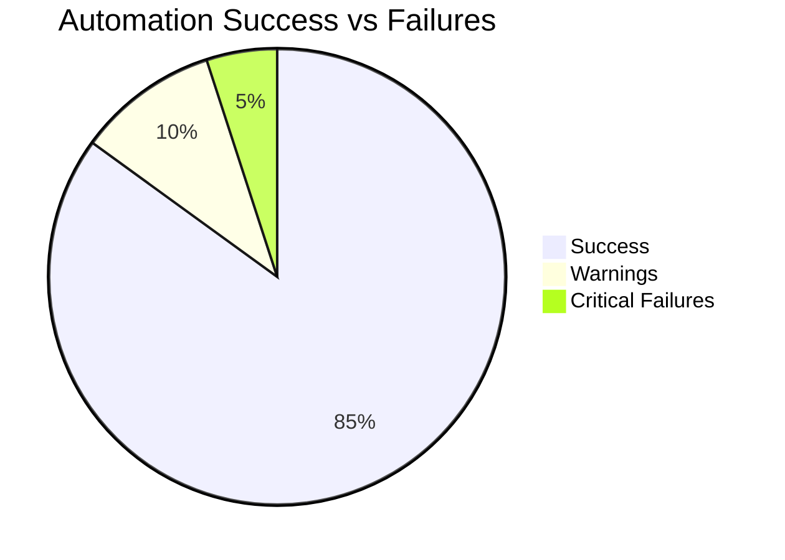
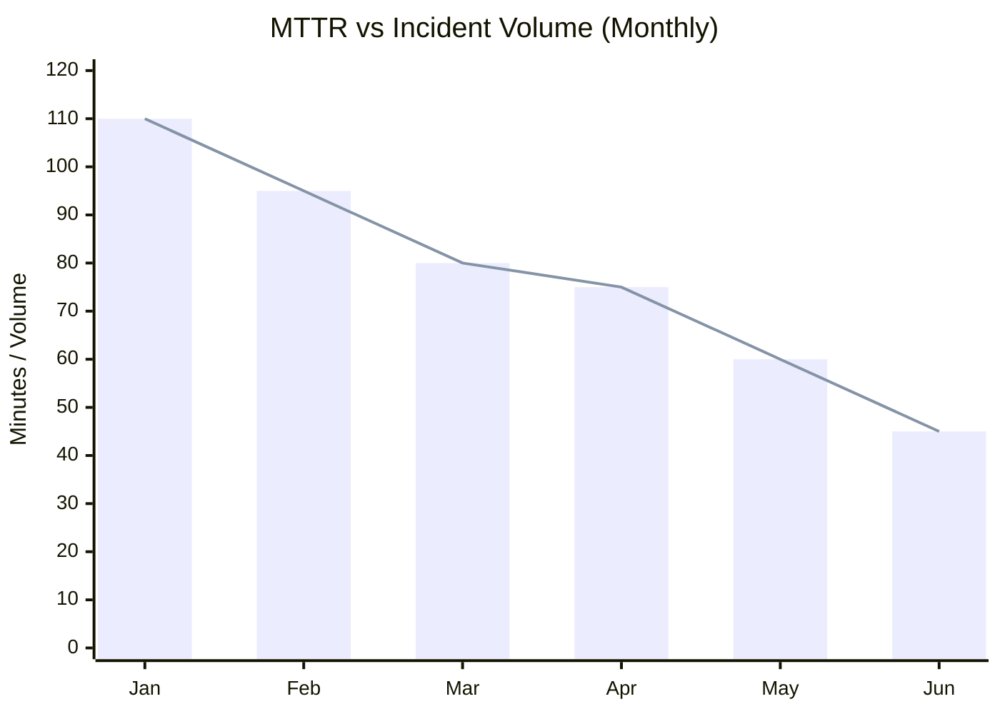
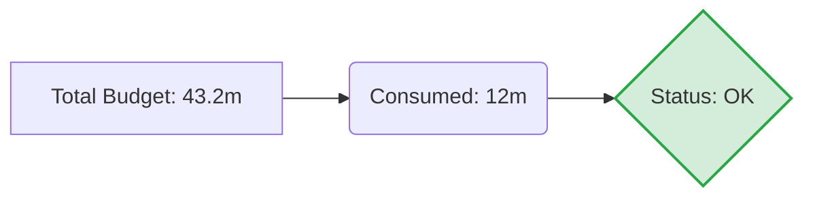

# Automation & Reliability Dashboard (Live Template)

## Document Control & Governance

| Field | Details |
| :--- | :--- |
| **Template ID** | ITSM-DASH-001 |
| **Version** | 2.0 |
| **Status** | Approved |
| **Owner** | Automation / SRE Team |
| **Reviewed By** | Data Analyst |
| **Approved By** | Head of DevOps |
| **Last Updated** | 2026-04-23 |
| **Next Review Date** | 2027-04-23 |

## 1. ITSM Control Fields

| Field | Value |
| :--- | :--- |
| **Priority** | [ ] P1 [ ] P2 [ ] P3 [ ] P4 |
| **Impact** | [ ] Users [ ] Systems [ ] Revenue |
| **SLA Improvement Target** | |
| **Change Failure Rate Target**| |
| **Environment** | [ ] Prod [ ] UAT [ ] Dev |
| **Service Name** | |

## 2. Traceability & Lifecycle

| Field | Value |
| :--- | :--- |
| **Linked Incident ID(s)** | |
| **Linked Problem ID** | |
| **Linked Change ID** | |
| **Linked RCA ID** | |
| **Linked CAPA ID** | |
| **Status** | [ ] New [ ] In Progress [ ] Under Review [ ] Closed |
| **Closure Criteria** | |
| **Closure Date** | |

## 3. Ownership & Accountability (RACI)

| Role | Assigned Team / Individual |
| :--- | :--- |
| **Responsible** | |
| **Accountable** | |
| **Consulted** | |
| **Informed** | |

---

## 4. Automation Success Rates
Track the reliability of automated scripts vs. manual execution.

## 5. MTTR & Incident Reduction Correlation
Monitor the reduction in MTTR and Incident Volume as automation is implemented.

## 6. SLA & Change Failure Rate Metrics
| Metric | Current Value | Target | Trend |
| :--- | :--- | :--- | :--- |
| **SLA Improvement** | +5% | +10% | [Rising] |
| **Change Failure Rate**| 2% | <1.5% | [Falling] |
| **Budget Burn Rate** | 15% | <30% | [Stable] |

## 7. Error Budget Burn (Rolling 30 Days)
Visual representation of error budget consumption.

## 8. Automation ROI Tracker
| Initiative | Hours Saved / Month | MTTR Impact | Risk Reduction | Incident Reduction |
| :--- | :--- | :--- | :--- | :--- |
| **Log Rotation Script** | 10h | Low | High | 15% |
| **Auto-Scaling Policy** | 40h | High | Medium | 30% |
| **Self-Healing Bot** | 25h | Critical | Very High | 50% |

## Evidence & References

* **Logs:**
* **Monitoring Alerts:**
* **Screenshots:**
* **Ticket Links:**

---
*Created by [Rahul Nethikar](https://rahulnethikar.github.io)*
*Upgraded to ITIL 4 & ISO 20000 Standards*
