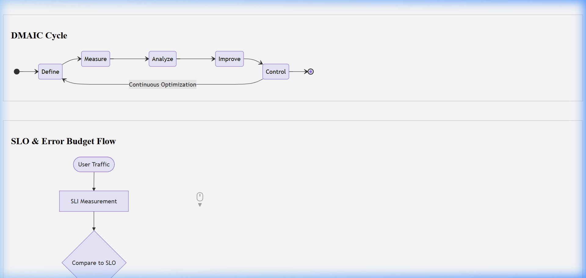

# Corrective and Preventive Action (CAPA) Tracker

## Document Control & Governance

| Field | Details |
| :--- | :--- |
| **Template ID** | ITSM-CAPA-001 |
| **Version** | 2.0 |
| **Status** | Approved |
| **Owner** | Quality & Compliance |
| **Reviewed By** | Internal Auditor |
| **Approved By** | Head of Operations |
| **Last Updated** | 2026-04-23 |
| **Next Review Date** | 2027-04-23 |

## 1. ITSM Control Fields

| Field | Value |
| :--- | :--- |
| **Priority** | [ ] P1 [ ] P2 [ ] P3 [ ] P4 |
| **Impact** | [ ] Users [ ] Systems [ ] Revenue |
| **Severity** | [ ] Critical [ ] Major [ ] Minor |
| **Environment** | [ ] Prod [ ] UAT [ ] Dev |
| **Service Name** | |

## 2. Traceability & Lifecycle

| Field | Value |
| :--- | :--- |
| **Linked Incident ID(s)** | |
| **Linked Problem ID** | |
| **Linked Change ID** | |
| **Linked RCA ID** | |
| **Linked CAPA ID** | |
| **Status** | [ ] New [ ] In Progress [ ] Under Review [ ] Closed |
| **Closure Criteria** | |
| **Closure Date** | |

## 3. Ownership & Accountability (RACI)

| Role | Assigned Team / Individual |
| :--- | :--- |
| **Responsible** | |
| **Accountable** | |
| **Consulted** | |
| **Informed** | |

---

## 4. CAPA Action Log

| Action ID | Linked RCA ID | Description | Owner | Due Date | Risk Reduction Score | Effectiveness Review Date | Audit Sign-off | Validation Status |
| :--- | :--- | :--- | :--- | :--- | :--- | :--- | :--- | :--- |
| CAPA-101 | RCA-2024-05 | Implement MFA | Rahul | 2024-06-15 | 9/10 | 2024-07-01 | [ ] | **Validated** |
| CAPA-102 | RCA-2024-05 | Update SOP | Team | 2024-06-20 | 5/10 | 2024-07-05 | [ ] | Pending |
| CAPA-103 | PMR-SRE-01 | Refactor socket | Dev | 2024-07-01 | 8/10 | 2024-07-15 | [ ] | In Progress |

## 5. Validation Definitions
- **Pending:** Action not yet started.
- **In Progress:** Work is underway.
- **Completed:** Action is finished but not yet verified.
- **Validated:** Action is finished and its effectiveness has been verified by a third party (Auditor/SRE Lead).

## Visual Workflow

## Evidence & References

* **Logs:**
* **Monitoring Alerts:**
* **Screenshots:**
* **Ticket Links:**

---
*Created by [Rahul Nethikar](https://rahulnethikar.github.io)*
*Upgraded to ITIL 4 & ISO 20000 Standards*
